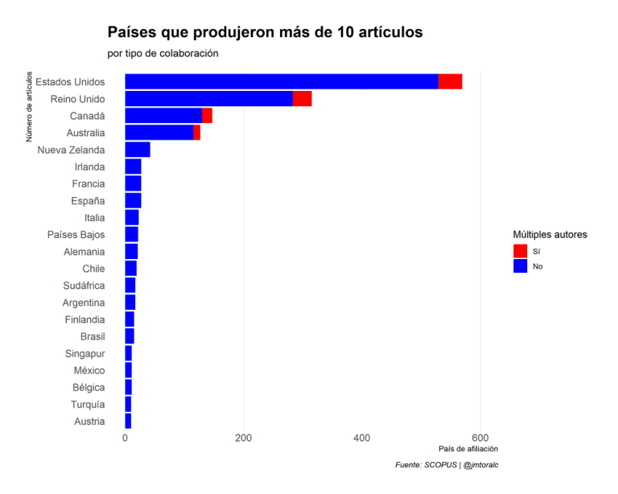
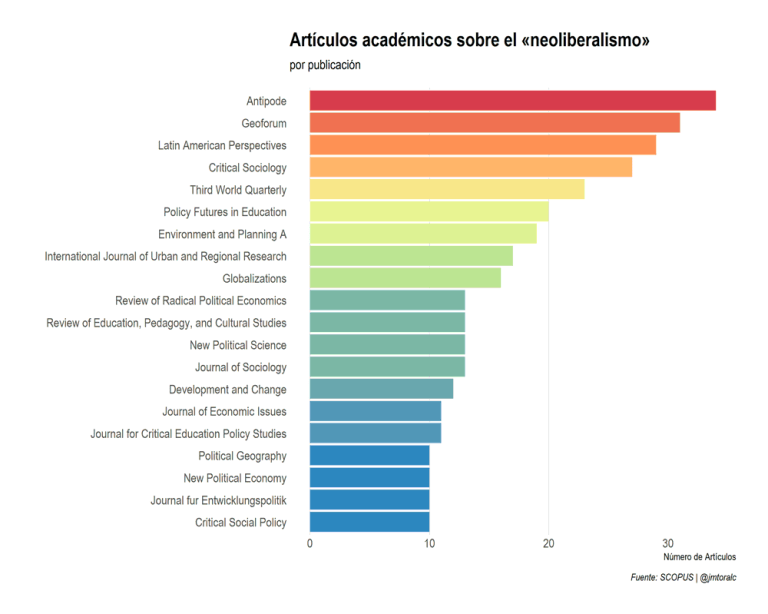
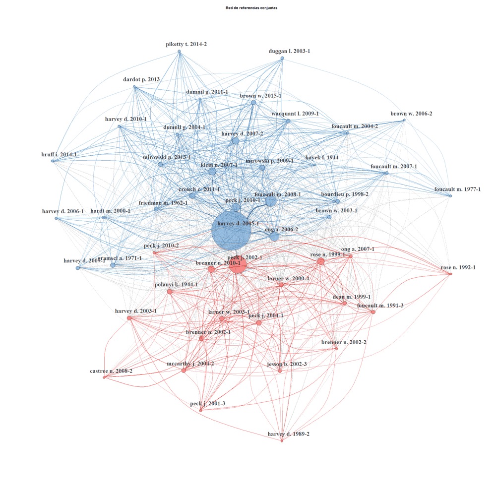
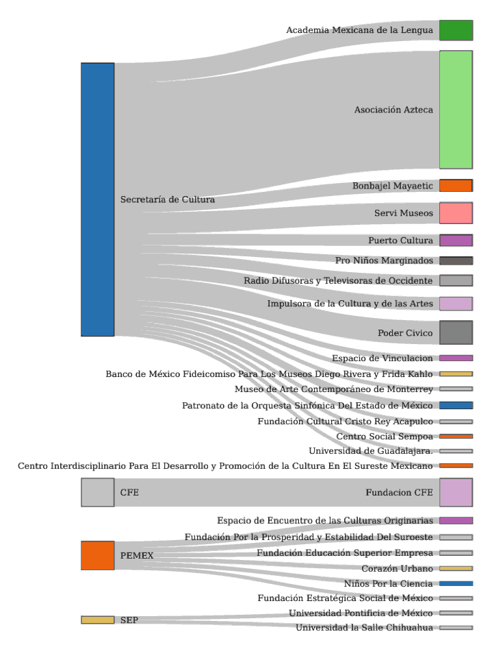
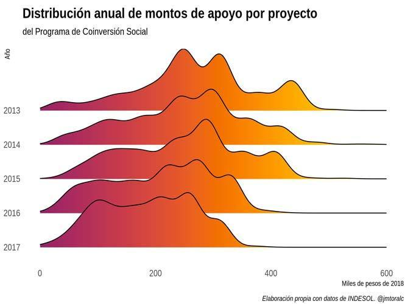
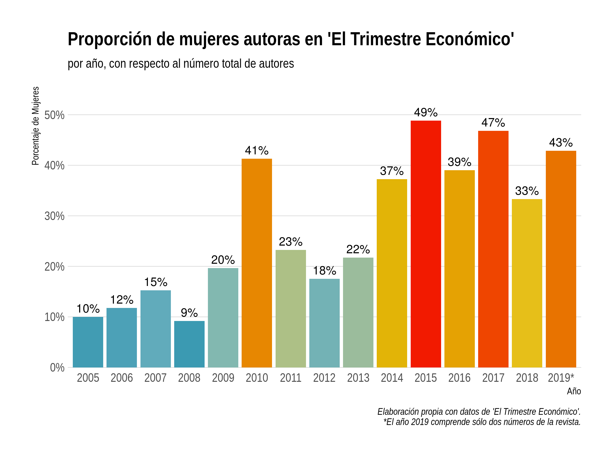
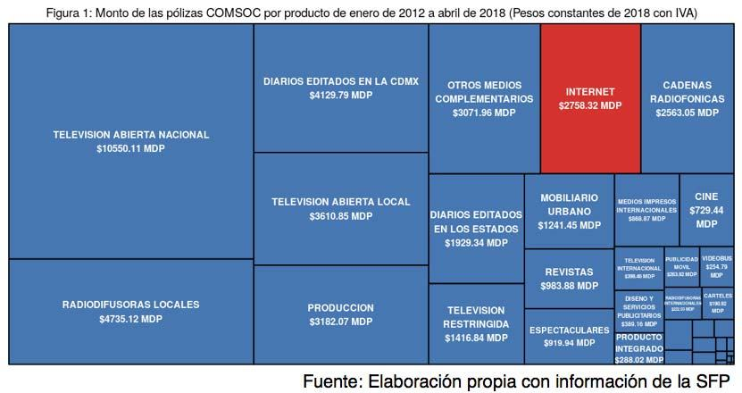

# A general comment on my work

My work can be read mainly in *Nexos*, one of the main policial analysis magazines in Mexico. This work was mainly made in Spanish.

# On *Nexos* Magazine

My work related on corruption can be read here:

https://anticorrupcion.nexos.com.mx/?author_name=manuel-toral

My work related to crime and discourse analysisis here:

https://datos.nexos.com.mx/?author_name=manuel-toral

# Some relevant projects

- **El neoliberalismo a vielo de pájaro** (*A Quick View of Neoliberalism*): This was an analysis of the concept of *neoliberalism* in academic literature in English. This project's motivation was the rethorical use of the concept in Mexican politics. [https://datos.nexos.com.mx/?p=943](https://datos.nexos.com.mx/?p=943)

- **Breve panorama de la sociedad civil** (*A Brief Panorama of the NGO Sector*): This was an three-part analysisi that tried to give a general overview of the situation of Mexican NGO sector.

    - Part 1:[https://anticorrupcion.nexos.com.mx/?p=572](https://datos.nexos.com.mx/?p=943)
    - Part 2:[https://anticorrupcion.nexos.com.mx/?p=619](https://datos.nexos.com.mx/?p=943)
    - Part 3:[https://anticorrupcion.nexos.com.mx/?p=661](https://datos.nexos.com.mx/?p=943)
    

- **En busca del cadáver del neoliberalismo: 14 años del Trimestre Económico** (*Looking for the corpse of neoliberalism*)[https://datos.nexos.com.mx/?p=807](https://datos.nexos.com.mx/?p=807): In this analysis I evaluate the most important academic journal in Economics in Spanish language: *El Trimestre Económico*. Mexican government changed the editorial line to a "non-neoliberal option".

- **Redes y propaganda: publicidad oficial en internet** (*Social networks and propaganda: government's ad on internet*)[https://anticorrupcion.nexos.com.mx/?p=300](https://anticorrupcion.nexos.com.mx/?p=300): In this analysis I evaluate the spending of Mexican Government on internet advertising.

